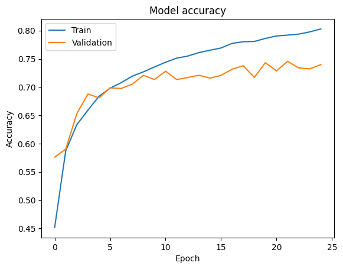
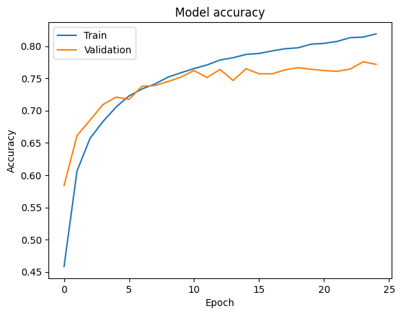

# Image Classification

Цель проекта — выполнить классификацию цветных изображений. Мы используем архитектуру Convolutional Neural Network (CNN) и применяем data augmentation и преобразования, чтобы распознавать класс изображения из заранее заданного набора из 10 классов.

## Data Set ([CIFAR-10](https://www.cs.toronto.edu/~kriz/cifar.html))
В работе используется датасет [CIFAR-10](https://www.cs.toronto.edu/~kriz/cifar.html) — широко применяемый бенчмарк в компьютерном зрении и machine learning Он служит стандартом для обучения и оценки алгоритмов image classification

Основные характеристики датасета:
- 60 000 цветных изображений 32×32, разделённых на 10 классов (по 6 000 на класс).
- 50 000 изображений для обучения и 10 000 для тестирования.
- Классы: airplane, automobile, bird, cat, deer, dog, frog, horse, ship, truck.

## Подробности классификации
Проект разбит на несколько шагов, отражающих ключевые этапы подготовки данных и анализа.  
- Реализация выполнена в двух средах: [TensorFlow](https://www.tensorflow.org/) и [PyTorch](https://pytorch.org/) — соответствующие ноутбуки лежат в папке notebooks.
- Каждый этап вынесен в отдельную секцию внутри соответствующего ноутбука.

### CIFAR-10 Classification: TensorFlow
> Соответствующий ноутбук:  image-classification-tensorflow.ipynb

ШАГ 1 — Initialization: импорт необходимых библиотек и модулей.

ШАГ 2 — Loading Dataset: загрузка данных из Keras dataset API и проверка форматов/размеров.

ШАГ 3 — Image Preprocessing: преобразования и augmentation с помощью ImageDataGenerator:  
1. Масштабирование пикселей к диапазону [0, 1].  
2. Случайный shear.  
3. Случайный zoom.  
4. Случайное горизонтальное отражение (horizontal flip).

ШАГ 4 — Building CNN Model: модель на базе Sequential включает:  
1. Input layer.  
2. Два convolutional слоя с активацией ReLU и ростом числа фильтров.  
3. Два слоя MaxPooling после свёрток.  
4. Flatten.  
5. Два dense / fully connected слоя с ReLU.  
6. Выходной слой с Softmax.

ШАГ 5 — Model Training: компиляция и обучение с параметрами:  
- Optimizer: Adam.  
- Loss: Categorical Crossentropy.  
- Batch size: 32; Epochs: 25.

ШАГ 6 — Performance Analysis: визуализация accuracy на train/validation по эпохам.  
- График: Training vs. Validation accuracy (TensorFlow)

---

### CIFAR-10 Classification: PyTorch
> Соответствующий ноутбук:  image-classification-pytorch.ipynb

ШАГ 1 — Initialization: импорт необходимых библиотек и модулей.

ШАГ 2 — Loading and Transforming Dataset:  
- Загрузка через torchvision и DataLoader:  
  - Batch size: 32  
  - Shuffle: True  
- Преобразования и augmentation c Compose:  
  - Случайные повороты (RandomRotation).  
  - Horizontal flip.  
  - Color jitter (яркость, контраст, насыщенность, hue).  
  - Масштабирование/нормализация значений пикселей.

ШАГ 3 — Building CNN Model: реализация на nn.Module:  
1. Input layer.  
2. Два convolutional слоя с ReLU.  
3. Два слоя MaxPooling.  
4. Flatten.  
5. Два dense / fully connected слоя с ReLU.  
6. Output layer с Softmax.  
7. Optimizer: Adam.  
8. Loss: CrossEntropyLoss.

ШАГ 4 — Model Training: базовая конфигурация обучения:  
- Epochs: 25.

ШАГ 5 — Performance Analysis: графики и разбор accuracy по эпохам.  
- Training vs. Validation accuracy (PyTorch)

